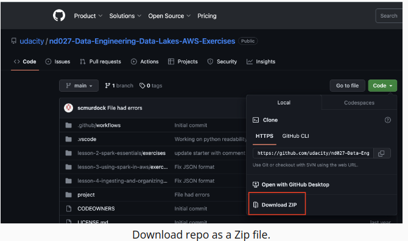
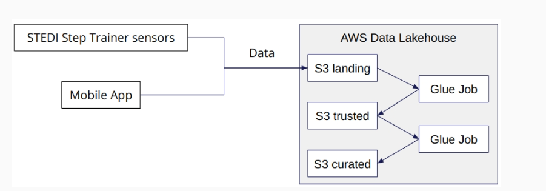

### STEDI Data Lakehouse

The STEDI Data Lakehouse is a solution for data sensor that trains a machine learning model.

#### The Device
There are sensors on the device that collect data to train a machine learning algorithm to detect steps. It also has a companion mobile app that collects customer data and interacts with the device sensors. The step trainer is just a motion sensor that records the distance of the object detected.

### AWS Tools

To build this data pipelines will be used the AWS cloud. The services used will be:

- IAM
- S3
- AWS GLUE and Spark
- Python
- AWS Athena

#### Dataset Details
The STEDI Team has been hard at work developing a hardware STEDI Step Trainer that:

- trains the user to do a STEDI balance exercise;
- and has sensors on the device that collect data to train a machine-learning algorithm to detect steps;
- has a companion mobile app that collects customer data and interacts with the device sensors.

STEDI has heard from millions of early adopters who are willing to purchase the STEDI Step Trainers and use them.

Several customers have already received their Step Trainers, installed the mobile application, and begun using them together to test their balance. The Step Trainer is just a motion sensor that records the distance of the object detected. The app uses a mobile phone accelerometer to detect motion in the X, Y, and Z directions.

The STEDI team wants to use the motion sensor data to train a machine learning model to detect steps accurately in real-time. Privacy will be a primary consideration in deciding what data can be used.

Some of the early adopters have agreed to share their data for research purposes. Only these customers’ Step Trainer and accelerometer data should be used in the training data for the machine learning model.

#### Project Data

STEDI has three JSON data sources(opens in a new tab) to use from the Step Trainer. Check out the JSON data in the following folders in the Github repo:

- customer
- step_trainer
- accelerometer

Here are the steps to download the data:

1. Go to nd027-Data-Engineering-Data-Lakes-AWS-Exercises(opens in a new tab) repository and click on Download Zip. Following the example:

2. Extract the zip file.

3. Navigate to the project/starter folder in the extracted output to find the JSON data files within three sub-folders. You should have:

    - **956** rows in the customer_landing table,
    - **81273** rows in the accelerometer_landing table, and
    - **28680** rows in the step_trainer_landing table.

##### Customer Records

This is the data from fulfillment and the STEDI website.

AWS S3 Bucket URI - s3://cd0030bucket/customers/

contains the following fields:

- serialnumber
- sharewithpublicasofdate
- birthday
- registrationdate
- sharewithresearchasofdate
- customername
- email
- lastupdatedate
- phone
- sharewithfriendsasofdate

##### Step Trainer Records

This is the data from the motion sensor.

AWS S3 Bucket URI - s3://cd0030bucket/step_trainer/

contains the following fields:

- sensorReadingTime
- serialNumber
- distanceFromObject

##### Accelerometer Records
AWS S3 Bucket URI - s3://cd0030bucket/accelerometer/

contains the following fields:

- timeStamp
- user
- x
- y
- z

**Note**: Lastly, you must review the project README(opens in a new tab) in the Github repo to understand the project structure.
#### Lakehouse Architecture

The image below show us the STEDI lakehouse and yours data sources.
This architecture is sliced in three zones:

- **landing**: raw data coming from the source and stored in the S3 bucket
- **trusted** : The trusted zone is the that contains raw data was transformed and turned trusted and were stored
- **curated**:This is last layer of trusted zone process. In this zone there are the join of trusted data with other dataset trusted and they are stored in layer curated. 

#### Results

In the final of the data pipeline, the zones will have this amount of data:

- Landing
    - Customer: 956
    - Accelerometer: 81273
    - Step Trainer: 28680
- Trusted
    - Customer: 482
    - Accelerometer: 40981
    - Step Trainer: 14460
- Curated
    - Customer: 482
    - Machine Learning: 43681

##### Scripts and Screenshots

The evidencias of this pipeline is founded in the folders located to root of repo and are sliced to zones:

- *landing_zone* folder: contains the python and sql scripts of glue jobs and queries images for landing zone

- *trusted_zone* folder:contains the python scripts of glue jobs and queries images for trusted zone

- *curated_zone* folder: contains the python scripts of glue jobs and queries images for curated zone

